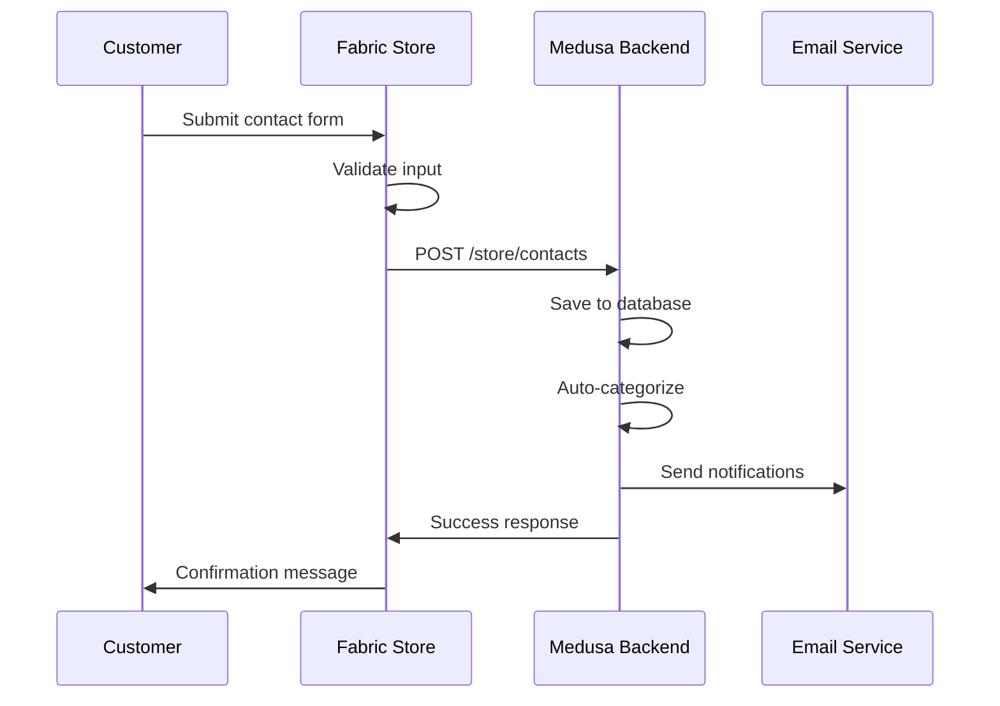
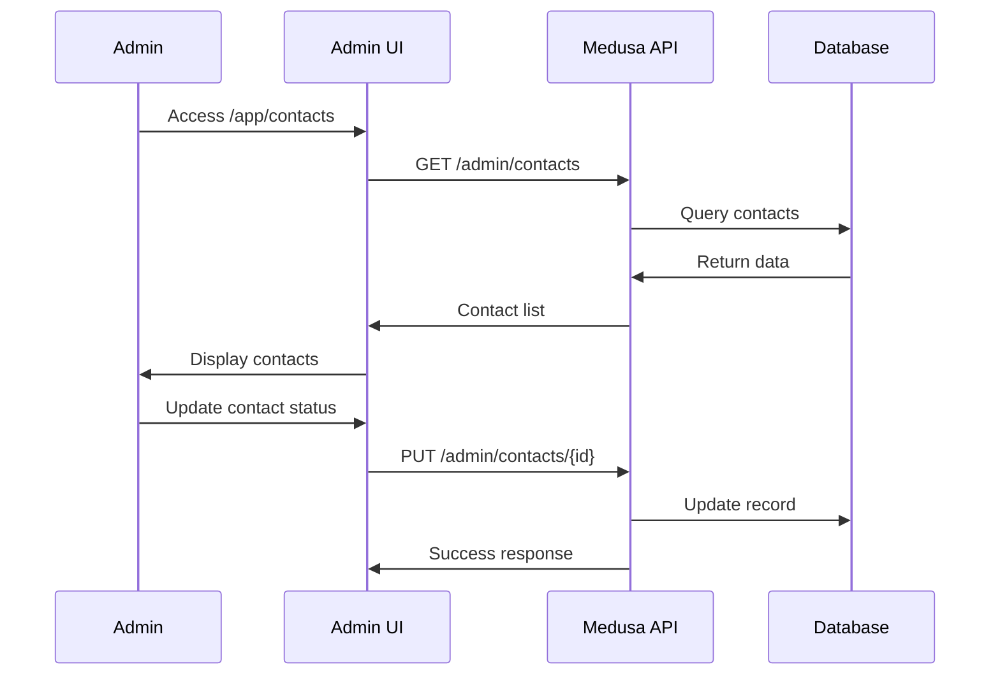

# Contact Form Integration Documentation

## Overview

The contact form integration connects the fabric-store frontend with the Medusa admin backend dashboard, providing a complete customer inquiry management system.

## Architecture

### Components Created

1. **Medusa Backend (`/medusa/src/`)**:
   - `models/contact.ts` - Contact entity with comprehensive fields
   - `services/contact.ts` - Business logic for contact management
   - `api/admin/contacts/` - Admin API routes for CRUD operations
   - `api/store/contacts/` - Public API for contact form submissions
   - `admin/routes/contacts/page.tsx` - Admin UI for contact management
   - `admin/widgets/contacts-overview.tsx` - Dashboard widget

2. **Fabric Store Frontend (`/frontend/experiences/fabric-store/`)**:
   - Updated `app/api/contact/route.ts` - Now integrates with Medusa backend

3. **Scripts (`/medusa/src/scripts/`)**:
   - `setup-contacts.ts` - Setup and initialization script
   - `test-contact-integration.ts` - Integration testing script

## Features

### Contact Management
- ✅ **Status Tracking**: new → in_progress → resolved → closed
- ✅ **Priority Levels**: low, medium, high, urgent
- ✅ **Auto-categorization**: Based on subject content analysis
- ✅ **Email Notifications**: Admin alerts and customer confirmations
- ✅ **Search & Filtering**: Advanced admin interface
- ✅ **Response Time Tracking**: Automatic timing metrics
- ✅ **Admin Notes**: Internal communication system

### Data Fields
```typescript
interface Contact {
  id: string
  name: string
  email: string
  phone?: string
  subject: string
  message: string
  order_number?: string
  status: "new" | "in_progress" | "resolved" | "closed"
  priority: "low" | "medium" | "high" | "urgent"
  category: string // auto-categorized
  source: string // "fabric_store", "admin", etc.
  admin_notes?: string
  responded_at?: Date
  created_at: Date
  updated_at: Date
}
```

### Auto-Categorization Rules
- **Order Support**: "order", "shipping", "delivery"
- **Fabric Inquiry**: "fabric", "material", "swatch"
- **Returns**: "return", "refund", "exchange"
- **Technical**: "technical", "website", "bug"
- **General**: Default category

## API Endpoints

### Store API (Public)
- `POST /store/contacts` - Submit contact form
- Validates input, saves to database, sends notifications

### Admin API (Protected)
- `GET /admin/contacts` - List contacts with filtering/pagination
- `GET /admin/contacts/stats` - Contact statistics
- `GET /admin/contacts/[id]` - Get specific contact
- `PUT /admin/contacts/[id]` - Update contact status/notes
- `DELETE /admin/contacts/[id]` - Soft delete contact
- `POST /admin/contacts` - Create contact (admin use)

### Query Parameters
```bash
# Filtering
GET /admin/contacts?status=new&priority=high&category=fabric_inquiry

# Searching
GET /admin/contacts?q=canvas%20fabric

# Pagination
GET /admin/contacts?offset=20&limit=10

# Date filtering
GET /admin/contacts?created_after=2024-01-01&created_before=2024-02-01
```

## Admin Dashboard

### Contact Management Page (`/app/contacts`)
- **Statistics Cards**: Total, new, urgent, response rates
- **Filter System**: Status, priority, category, source
- **Search**: Full-text search across all fields
- **Contact List**: Paginated table with key information
- **Detail Modal**: Full contact view with status management
- **Bulk Actions**: Mass status updates (planned)

### Dashboard Widget
- **Quick Stats**: New, in-progress, today's count
- **Recent Contacts**: Latest 5 submissions
- **Urgent Alerts**: Highlighted urgent items
- **Navigation**: Direct links to full contact management

## Integration Flow

### 1. Customer Submits Form


### 2. Admin Management


## Setup Instructions

### 1. Run Setup Script
```bash
cd medusa
npm run setup:contacts
```

### 2. Environment Variables (Optional)
```env
# Email notifications
RESEND_API_KEY=re_xxxxxxxxxxxxx
ADMIN_EMAIL=admin@yourdomain.com

# Frontend integration
MEDUSA_BACKEND_URL=http://localhost:9000
```

### 3. Test Integration
```bash
cd medusa
npm run test:contacts
```

### 4. Access Admin UI
- Navigate to: http://localhost:9000/app/contacts
- Login with Google OAuth or admin credentials

## Testing

### Manual Testing
1. **Contact Form Submission**:
   - Visit: http://localhost:3006/contact
   - Fill and submit form
   - Check admin dashboard for new entry

2. **Admin Management**:
   - Access: http://localhost:9000/app/contacts
   - Test filtering, search, status updates
   - Verify statistics accuracy

### Automated Testing
```bash
# Run integration test
cd medusa
npm run test:contacts

# Test specific components
curl -X POST http://localhost:9000/store/contacts \
  -H "Content-Type: application/json" \
  -d '{"name":"Test","email":"test@example.com","subject":"Test","message":"Hello"}'
```

## Error Handling & Fallbacks

### Fabric Store Integration
- **Primary**: Submit to Medusa backend
- **Fallback**: Local processing with email notifications
- **Graceful Degradation**: Always provides user feedback

### Medusa Backend
- **Validation**: Comprehensive input validation
- **Error Responses**: Structured error messages
- **Logging**: Detailed error logging for debugging

## Performance Considerations

### Database
- **Indexes**: Created on searchable fields (name, email, subject)
- **Pagination**: Efficient offset/limit queries
- **Soft Deletes**: Maintains data integrity

### Caching
- **Statistics**: Can be cached for dashboard performance
- **Search**: Full-text search with PostgreSQL indexes

## Security

### Input Validation
- Email format validation
- Phone number format validation
- SQL injection prevention (parameterized queries)
- XSS protection (input sanitization)

### Authentication
- Admin routes protected by Medusa authentication
- Store routes are public (as intended for contact forms)
- CORS configured for fabric-store origin

## Monitoring & Analytics

### Metrics Available
- Total contact submissions
- Response times by status
- Category distribution
- Source tracking (fabric_store vs admin)
- Daily/weekly/monthly trends

### Dashboard Statistics
- Real-time counts by status
- Urgent priority alerts
- Response rate calculations
- Time-based analytics

## Future Enhancements

### Planned Features
- **Email Templates**: Rich HTML email templates
- **Automated Responses**: Auto-replies based on category
- **Integration Webhooks**: External system notifications
- **Bulk Operations**: Mass status updates
- **Advanced Analytics**: Detailed reporting dashboard
- **Customer Portal**: Self-service status checking

### API Extensions
- **REST to GraphQL**: GraphQL API layer
- **Webhooks**: Real-time external notifications
- **Bulk Import**: CSV import for historical data
- **Export**: CSV/Excel export functionality

## Troubleshooting

### Common Issues

1. **Contact Form Not Submitting**:
   - Check Medusa backend is running (port 9000)
   - Verify CORS configuration
   - Check network connectivity

2. **Admin UI Not Loading Contacts**:
   - Verify admin authentication
   - Check API endpoint availability
   - Review browser console for errors

3. **Email Notifications Not Sending**:
   - Confirm RESEND_API_KEY is set
   - Check email addresses are valid
   - Review Medusa logs for email errors

### Debug Commands
```bash
# Check Medusa logs
cd medusa && npm run dev

# Test API directly
curl -X GET http://localhost:9000/admin/contacts

# Verify database schema
# Connect to PostgreSQL and check contact table exists
```

## File Locations

### Medusa Backend
```
/medusa/src/
├── models/contact.ts
├── services/contact.ts
├── api/
│   ├── admin/contacts/
│   └── store/contacts/
├── admin/
│   ├── routes/contacts/page.tsx
│   └── widgets/contacts-overview.tsx
└── scripts/
    ├── setup-contacts.ts
    └── test-contact-integration.ts
```

### Frontend
```
/frontend/experiences/fabric-store/
└── app/api/contact/route.ts (updated)
```

This integration provides a complete, production-ready contact management system with excellent admin experience and customer-facing functionality.