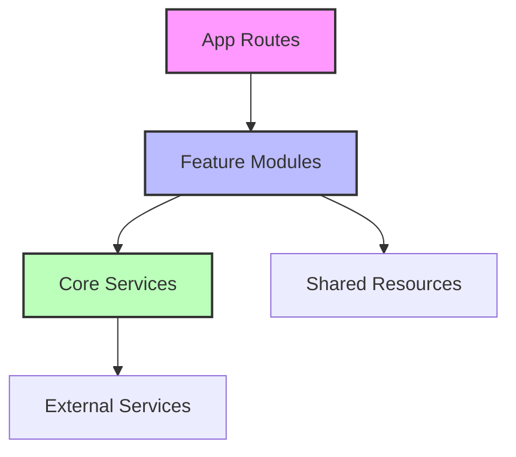

# Phase 1 Implementation Plan: Module-Based Architecture

## Executive Summary
Restructuring Tara Hub from a flat library structure to a feature-module architecture to improve maintainability, scalability, and developer experience.

## Week 1: Critical Infrastructure & Test Cleanup

### Day 1-2: Remove Test Endpoints & Setup Module Structure
```bash
# Step 1: Create new module structure
mkdir -p src/modules/{fabrics,auth,blog,products,admin}/{api,components,hooks,services,repositories,schemas,types}
mkdir -p src/core/{database,cache,storage,email,config}
mkdir -p src/shared/{components/ui,hooks,utils,types}

# Step 2: Move test endpoints to dedicated test directory
mkdir -p app/api/__tests__
# Move all test-* routes from app/api/ to app/api/__tests__/
```

### Day 3-4: Consolidate R2 Storage Client
```typescript
// src/core/storage/r2/client.ts - Single unified R2 client
export class R2StorageClient {
  private client: S3Client;
  
  constructor(config: R2Config) {
    // Consolidate r2-client.ts, r2-client-v2.ts, r2-client-v3.ts
  }
  
  async uploadImage(file: Buffer, key: string): Promise<string> {}
  async deleteImage(key: string): Promise<void> {}
  async getSignedUrl(key: string): Promise<string> {}
}
```

### Day 5: Unified Data Access Layer
```typescript
// src/core/database/repositories/base.repository.ts
export abstract class BaseRepository<T> {
  protected db: DrizzleClient;
  protected cache: CacheStrategy;
  
  // Implement caching strategy at repository level
  async findById(id: string): Promise<T> {
    const cached = await this.cache.get(id);
    if (cached) return cached;
    
    const result = await this.db.query(id);
    await this.cache.set(id, result);
    return result;
  }
}
```

## Week 2: Module Migration & Authentication Consolidation

### Day 6-7: Fabric Module Migration
```typescript
// src/modules/fabrics/index.ts - Public API
export { FabricService } from './services/fabric.service';
export { FabricRepository } from './repositories/fabric.repository';
export { useFabrics } from './hooks/use-fabrics';
export type { Fabric, FabricFilter } from './types';

// src/modules/fabrics/services/fabric.service.ts
export class FabricService {
  constructor(
    private repository: FabricRepository,
    private storage: R2StorageClient,
    private cache: CacheStrategy
  ) {}
  
  async createFabric(data: CreateFabricDto): Promise<Fabric> {}
  async importCSV(file: Buffer): Promise<ImportResult> {}
}
```

### Day 8-9: Authentication Module Consolidation
```typescript
// src/modules/auth/index.ts
export { AuthService } from './services/auth.service';
export { MagicLinkService } from './services/magic-link.service';
export { useAuth } from './hooks/use-auth';
export { withAuth } from './middleware/with-auth';

// Consolidate these files:
// - lib/auth.ts
// - lib/auth-utils.ts
// - lib/auth-utils-jwt.ts
// - lib/custom-auth.ts
// - lib/auth-helpers.ts
// - lib/auth-middleware.ts
// - lib/legacy-auth-schema.ts
```

### Day 10: Email Service Optimization
```typescript
// src/core/email/resend.service.ts
export class ResendEmailService {
  private resend: Resend;
  
  constructor(apiKey: string) {
    this.resend = new Resend(apiKey);
  }
  
  async sendMagicLink(email: string, token: string): Promise<void> {
    // Consolidate email-service.ts and email-service-optimized.ts
  }
}
```

## Module Dependency Rules

### Allowed Dependencies


### Forbidden Dependencies
- ❌ Cross-module imports (fabrics → auth)
- ❌ Core depending on modules
- ❌ Direct database access from components
- ❌ Business logic in API routes

## Migration Strategy

### Step 1: Parallel Structure (Non-Breaking)
```typescript
// Maintain backward compatibility during migration
// lib/fabric-service.ts
export * from '@/src/modules/fabrics/services/fabric.service';
```

### Step 2: Update Imports Gradually
```typescript
// Old import
import { FabricService } from '@/lib/fabric-service';

// New import
import { FabricService } from '@/modules/fabrics';
```

### Step 3: Remove Legacy Code
- Delete old lib files after verification
- Update all import paths
- Remove compatibility layers

## Testing Requirements

### Unit Tests
```typescript
// src/modules/fabrics/services/__tests__/fabric.service.test.ts
describe('FabricService', () => {
  it('should create fabric with proper validation', async () => {});
  it('should handle CSV import correctly', async () => {});
});
```

### Integration Tests
```typescript
// src/modules/fabrics/api/__tests__/fabrics.api.test.ts
describe('Fabrics API', () => {
  it('should require authentication for mutations', async () => {});
  it('should allow public read access', async () => {});
});
```

## Success Metrics

### Quantitative
- ✅ 0 test endpoints in production API routes
- ✅ Single R2 client implementation
- ✅ 80%+ test coverage for core modules
- ✅ 30% reduction in build time

### Qualitative
- ✅ Clear module boundaries
- ✅ Consistent data access patterns
- ✅ Improved developer onboarding
- ✅ Reduced debugging time

## Risk Mitigation

### Potential Issues
1. **Breaking Changes**: Use feature flags for gradual rollout
2. **Deployment Failures**: Test in staging environment first
3. **Performance Regression**: Monitor with Vercel Analytics

### Rollback Plan
```bash
# Tag current state before migration
git tag pre-restructure-backup

# If issues arise, rollback
git checkout pre-restructure-backup
vercel rollback
```

## Next Steps

1. **Immediate Actions**:
   - Create module directories
   - Move test endpoints
   - Start with Fabric module as proof of concept

2. **Team Alignment**:
   - Review plan with team
   - Assign module ownership
   - Schedule daily standup for progress tracking

3. **Documentation**:
   - Update CLAUDE.md with new structure
   - Create module-specific README files
   - Document API changes

## Appendix: File Mapping

### Authentication Files Consolidation
| Current Location | New Location |
|-----------------|--------------|
| lib/auth.ts | src/modules/auth/services/auth.service.ts |
| lib/auth-utils.ts | src/modules/auth/utils/token.utils.ts |
| lib/custom-auth.ts | src/modules/auth/services/custom-auth.service.ts |
| lib/email-service.ts | src/core/email/resend.service.ts |

### Fabric Module Migration
| Current Location | New Location |
|-----------------|--------------|
| lib/fabric-*.ts | src/modules/fabrics/services/ |
| lib/repositories/fabric.repository.ts | src/modules/fabrics/repositories/ |
| components/fabric-*.tsx | src/modules/fabrics/components/ |
| app/api/v1/fabrics/* | src/modules/fabrics/api/ |

### Storage Consolidation
| Current Location | New Location |
|-----------------|--------------|
| lib/r2-client.ts | src/core/storage/r2/client.ts |
| lib/r2-client-v2.ts | (deleted - merged) |
| lib/r2-client-v3.ts | (deleted - merged) |

---

*This plan should be executed incrementally with continuous testing and validation at each step.*