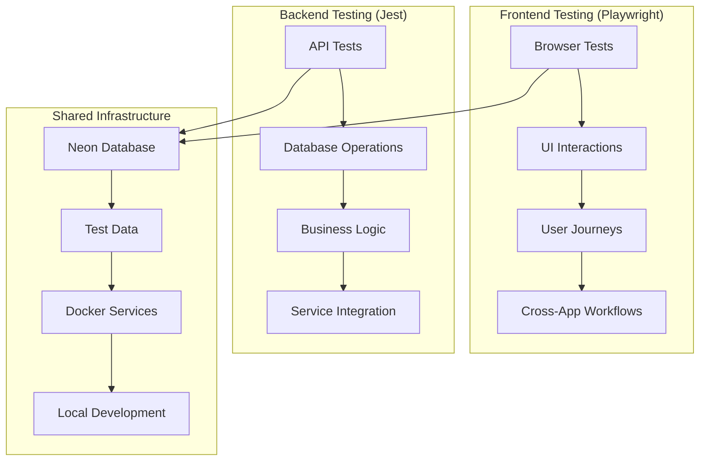

# Comprehensive Testing Strategy

This project uses a **dual testing approach** combining **Playwright E2E** and **Jest API testing** for complete coverage.

## 🎯 **Testing Architecture Overview**



## 🔧 **Two Complementary Approaches**

### **1. Playwright E2E Testing (Your Friend's Setup)**

**Purpose**: Full-stack user experience testing
- **Technology**: Docker + Playwright + Browser automation
- **Scope**: Frontend user journeys, UI interactions, cross-app workflows
- **Target**: User acceptance testing, integration testing

```bash
# Playwright Commands
npm run test:e2e           # Run all Playwright tests
npx playwright test        # Direct Playwright execution
npx playwright show-report # View test results
```

**Key Features**:
- ✅ Real browser automation (Chrome, Firefox, Safari)
- ✅ Multi-app testing (admin, fabric-store, store-guide)
- ✅ Visual regression testing
- ✅ Mobile/responsive testing
- ✅ Network interception and mocking

### **2. Jest API Testing (Our Enhanced Setup)**

**Purpose**: Backend service and API testing
- **Technology**: Neon DB + Jest + Medusa v2 + MikroORM
- **Scope**: API endpoints, database operations, business logic
- **Target**: Service layer testing, data consistency, performance

```bash
# Jest API Commands
npm run test:e2e:enhanced     # Enhanced API tests
npm run test:e2e:performance  # With performance monitoring
npm run test:e2e:materials    # Specific API tests
npm run test:db:init          # Database setup
```

**Key Features**:
- ✅ Real cloud database testing (Neon)
- ✅ Transaction-based isolation
- ✅ Performance monitoring
- ✅ Medusa v2 service integration
- ✅ ORM-based data management

## 🚀 **Getting Started**

### **Option 1: Full Stack Testing (Recommended)**

1. **Start Docker Services** (Backend + Database):
   ```bash
   docker-compose up -d
   ```

2. **Start Frontend Apps**:
   ```bash
   # Terminal 1: Main admin app
   npm run dev

   # Terminal 2: Fabric store
   npm run dev:fabric-store

   # Terminal 3: Store guide
   npm run dev:store-guide
   ```

3. **Run Complete Test Suite**:
   ```bash
   # Playwright tests (UI/UX)
   npm run test:e2e

   # API tests (Backend)
   cd medusa && npm run test:e2e:enhanced
   ```

### **Option 2: API-Only Testing**

```bash
# Setup database
cd medusa && npm run test:db:init

# Run API tests against cloud database
npm run test:e2e:enhanced
```

### **Option 3: UI-Only Testing**

```bash
# Ensure backend is running
docker-compose up medusa postgres

# Run Playwright tests
npm run test:e2e
```

## 📊 **Test Data Strategy**

### **Shared Test Data Approach**

Both testing approaches use the **same Neon database** with different isolation strategies:

```typescript
// Playwright tests use API setup
const testDataSetup = new PlaywrightTestDataSetup();
const testData = await testDataSetup.setupEcommerceScenario();

// Jest tests use enhanced fixtures
const testSuite = useE2ETestSuite();
await testSuite.setupScenario('basicMaterials');
```

**Benefits**:
- ✅ Consistent test data across both approaches
- ✅ Real database state for UI tests
- ✅ API validation with actual data
- ✅ No mock/stub complexity

## 🎯 **Test Scenarios Coverage**

### **Playwright E2E Scenarios**

| Scenario | Description | Files |
|----------|-------------|-------|
| **Smoke Tests** | Basic service health | `e2e/smoke.spec.ts` |
| **Fabric Store Journey** | Complete shopping flow | `e2e/fabric-store.spec.ts` |
| **Admin Dashboard** | Management workflows | `e2e/admin-dashboard.spec.ts` |

### **Jest API Scenarios**

| Scenario | Description | Files |
|----------|-------------|-------|
| **Materials API** | CRUD operations | `medusa/src/api/admin/materials/__tests__/` |
| **Products API** | Product-material links | `medusa/src/api/admin/products/__tests__/` |
| **Performance Tests** | Query optimization | Enhanced tests with monitoring |

## 🔍 **Test Execution Strategies**

### **Development Workflow**

```bash
# 1. Quick smoke test
npm run test:e2e -- --grep "smoke"

# 2. API development
cd medusa && npm run test:e2e:enhanced

# 3. Full regression
npm run test:e2e && cd medusa && npm run test:e2e:enhanced
```

### **CI/CD Pipeline**

```yaml
# Example GitHub Actions
- name: Setup Test Environment
  run: |
    docker-compose up -d postgres medusa
    cd medusa && npm run test:db:init

- name: Run API Tests
  run: cd medusa && npm run test:e2e:enhanced

- name: Start Frontend Services
  run: |
    npm run dev &
    npm run dev:fabric-store &
    npm run dev:store-guide &

- name: Run E2E Tests
  run: npm run test:e2e
```

## 🛠 **Configuration Files**

### **Playwright Configuration**

```typescript
// playwright.config.ts
export default defineConfig({
  testDir: './e2e',
  timeout: 30000,
  use: {
    baseURL: 'http://localhost:3000',
    trace: 'on-first-retry',
  },
  projects: [
    { name: 'chromium', use: { ...devices['Desktop Chrome'] } },
    { name: 'webkit', use: { ...devices['Desktop Safari'] } },
  ],
});
```

### **Jest Configuration**

```javascript
// medusa/jest.config.js
module.exports = {
  testEnvironment: "node",
  setupFilesAfterEnv: ["<rootDir>/src/test-utils/jest-e2e-setup.ts"],
  testTimeout: 60000,
  testMatch: ["**/src/**/__tests__/**/*.e2e.spec.[jt]s"],
};
```

## 📈 **Performance & Monitoring**

### **API Performance Testing**

```typescript
await measureTestPerformance(async () => {
  const response = await request(app)
    .get('/admin/materials')
    .expect(200);
}, 'Materials API', 500); // Expect under 500ms
```

### **UI Performance Testing**

```typescript
test('page should load quickly', async ({ page }) => {
  const startTime = Date.now();
  await page.goto('/');
  const loadTime = Date.now() - startTime;

  expect(loadTime).toBeLessThan(3000); // Under 3 seconds
});
```

## 🎭 **Debugging & Troubleshooting**

### **Playwright Debugging**

```bash
# Interactive mode
npx playwright test --debug

# UI mode
npx playwright test --ui

# Headed mode
npx playwright test --headed
```

### **Jest Debugging**

```bash
# Performance debugging
DEBUG_PERFORMANCE=true npm run test:e2e:enhanced

# ORM debugging
DEBUG_ORM=true npm run test:e2e:enhanced

# Specific test
npm run test:e2e:enhanced -- --testNamePattern="materials"
```

## 🚨 **Common Issues & Solutions**

### **Service Not Running**

```bash
# Check services
docker-compose ps

# Restart services
docker-compose restart

# View logs
docker-compose logs medusa
```

### **Database Connection Issues**

```bash
# Test database connectivity
cd medusa && npm run test:db:init

# Check environment variables
echo $DATABASE_URL_TEST
```

### **Port Conflicts**

```bash
# Check port usage
lsof -i :3000 -i :3006 -i :3007 -i :9000

# Update port configuration in respective configs
```

## 🎯 **Best Practices**

### **Test Isolation**

- ✅ Use unique prefixes for test data
- ✅ Clean up after each test
- ✅ Use transactions where possible
- ✅ Avoid dependencies between tests

### **Performance**

- ✅ Batch database operations
- ✅ Use connection pooling
- ✅ Monitor query performance
- ✅ Clean up resources properly

### **Maintainability**

- ✅ Use page object pattern (Playwright)
- ✅ Share test utilities
- ✅ Document test scenarios
- ✅ Version control test data

This comprehensive testing strategy ensures **both frontend user experience** and **backend service reliability** while maintaining **fast development cycles** and **production confidence**! 🎉