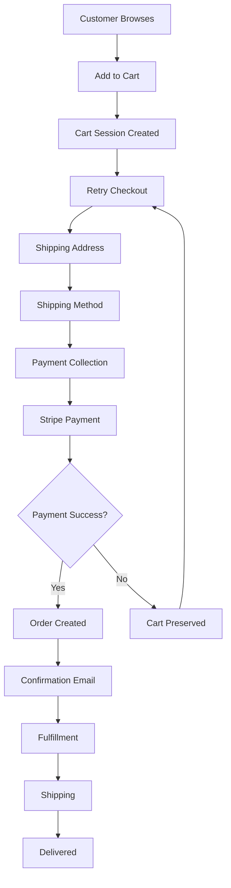

# 📚 Complete Order System Implementation Guide for Developers

## **Executive Summary**
This guide provides the complete implementation details for transitioning from a file-based order system to Medusa's production-ready cart/order system. Since the data is test data, we focus on building the correct long-term architecture rather than migration.

---

## 🏗️ **Architecture Overview**

### **Current State (TO BE REMOVED)**
```
┌─────────────┐     ┌──────────────┐     ┌──────────────┐
│   Browser   │────▶│   Next.js    │────▶│ .orders.json │
└─────────────┘     │   API Route  │     │    (File)    │
                    └──────────────┘     └──────────────┘
                           ↓
                    ┌──────────────┐
                    │   Stripe     │
                    │   Direct     │
                    └──────────────┘
```

### **Target Architecture (TO IMPLEMENT)**
```
┌─────────────┐     ┌──────────────┐     ┌──────────────┐
│   Browser   │────▶│   Next.js    │────▶│   Medusa     │
└─────────────┘     │   API Route  │     │   Backend    │
                    └──────────────┘     └──────────────┘
                                                 ↓
                                          ┌──────────────┐
                                          │  PostgreSQL  │
                                          │   Database   │
                                          └──────────────┘
                                                 ↓
                                          ┌──────────────┐
                                          │Stripe Plugin │
                                          │  (Webhooks)  │
                                          └──────────────┘
```

---

## 🔄 **Order Flow Implementation**

### **Complete Order Lifecycle**



---

## 💻 **Detailed Implementation Code**

### **1. Cart Management System**

#### **1.1 Cart Context Provider (Frontend)**
```typescript
// contexts/CartContext.tsx
import React, { createContext, useContext, useState, useEffect } from 'react'
import { Medusa } from '@medusajs/js-sdk'

interface CartItem {
  variant_id: string
  quantity: number
  metadata?: Record<string, any>
}

interface CartContextType {
  cart: any | null
  loading: boolean
  error: string | null
  addItem: (item: CartItem) => Promise<void>
  updateItem: (lineItemId: string, quantity: number) => Promise<void>
  removeItem: (lineItemId: string) => Promise<void>
  clearCart: () => Promise<void>
  refreshCart: () => Promise<void>
}

const CartContext = createContext<CartContextType | undefined>(undefined)

export const CartProvider: React.FC<{ children: React.ReactNode }> = ({ children }) => {
  const [cart, setCart] = useState<any>(null)
  const [loading, setLoading] = useState(true)
  const [error, setError] = useState<string | null>(null)

  const medusa = new Medusa({
    baseUrl: process.env.NEXT_PUBLIC_MEDUSA_BACKEND_URL!,
    publishableKey: process.env.NEXT_PUBLIC_MEDUSA_PUBLISHABLE_KEY
  })

  // Initialize or retrieve cart on mount
  useEffect(() => {
    initializeCart()
  }, [])

  const initializeCart = async () => {
    try {
      setLoading(true)

      // Check for existing cart in localStorage
      const cartId = localStorage.getItem('medusa_cart_id')

      if (cartId) {
        // Try to retrieve existing cart
        try {
          const existingCart = await medusa.carts.retrieve(cartId)
          if (existingCart && existingCart.cart) {
            setCart(existingCart.cart)
            setLoading(false)
            return
          }
        } catch (err) {
          // Cart might be completed or expired
          localStorage.removeItem('medusa_cart_id')
        }
      }

      // Create new cart if no valid cart exists
      const { cart: newCart } = await medusa.carts.create({
        region_id: process.env.NEXT_PUBLIC_REGION_ID || 'reg_01K5DPKAZ3AJRAR7N8SWSCVKSQ',
        metadata: {
          source: 'fabric-store',
          created_via: 'web'
        }
      })

      setCart(newCart)
      localStorage.setItem('medusa_cart_id', newCart.id)

    } catch (err: any) {
      setError(err.message || 'Failed to initialize cart')
    } finally {
      setLoading(false)
    }
  }

  const addItem = async (item: CartItem) => {
    if (!cart) {
      await initializeCart()
      if (!cart) throw new Error('Failed to initialize cart')
    }

    try {
      setLoading(true)

      // Check if item already exists in cart
      const existingItem = cart.items?.find(
        (i: any) => i.variant_id === item.variant_id
      )

      if (existingItem) {
        // Update quantity if item exists
        const { cart: updatedCart } = await medusa.carts.lineItems.update(
          cart.id,
          existingItem.id,
          {
            quantity: existingItem.quantity + item.quantity
          }
        )
        setCart(updatedCart)
      } else {
        // Add new item
        const { cart: updatedCart } = await medusa.carts.lineItems.create(
          cart.id,
          {
            variant_id: item.variant_id,
            quantity: item.quantity,
            metadata: item.metadata
          }
        )
        setCart(updatedCart)
      }

      // Show success toast/notification
      showNotification('Item added to cart', 'success')

    } catch (err: any) {
      setError(err.message || 'Failed to add item')
      showNotification('Failed to add item to cart', 'error')
    } finally {
      setLoading(false)
    }
  }

  const updateItem = async (lineItemId: string, quantity: number) => {
    if (!cart) return

    try {
      setLoading(true)

      if (quantity === 0) {
        await removeItem(lineItemId)
        return
      }

      const { cart: updatedCart } = await medusa.carts.lineItems.update(
        cart.id,
        lineItemId,
        { quantity }
      )
      setCart(updatedCart)

    } catch (err: any) {
      setError(err.message || 'Failed to update item')
    } finally {
      setLoading(false)
    }
  }

  const removeItem = async (lineItemId: string) => {
    if (!cart) return

    try {
      setLoading(true)
      const { cart: updatedCart } = await medusa.carts.lineItems.delete(
        cart.id,
        lineItemId
      )
      setCart(updatedCart)
      showNotification('Item removed from cart', 'info')

    } catch (err: any) {
      setError(err.message || 'Failed to remove item')
    } finally {
      setLoading(false)
    }
  }

  const clearCart = async () => {
    localStorage.removeItem('medusa_cart_id')
    setCart(null)
    await initializeCart()
  }

  const refreshCart = async () => {
    if (!cart) return

    try {
      const { cart: refreshedCart } = await medusa.carts.retrieve(cart.id)
      setCart(refreshedCart)
    } catch (err: any) {
      setError(err.message || 'Failed to refresh cart')
    }
  }

  return (
    <CartContext.Provider
      value={{
        cart,
        loading,
        error,
        addItem,
        updateItem,
        removeItem,
        clearCart,
        refreshCart
      }}
    >
      {children}
    </CartContext.Provider>
  )
}

export const useCart = () => {
  const context = useContext(CartContext)
  if (!context) {
    throw new Error('useCart must be used within CartProvider')
  }
  return context
}
```

---

### **2. Checkout Implementation**

#### **2.1 Checkout Flow Component**
```typescript
// components/checkout/CheckoutFlow.tsx
import { useState } from 'react'
import { useCart } from '@/contexts/CartContext'
import { Medusa } from '@medusajs/js-sdk'
import { loadStripe } from '@stripe/stripe-js'
import {
  Elements,
  PaymentElement,
  useStripe,
  useElements
} from '@stripe/react-stripe-js'

const stripePromise = loadStripe(process.env.NEXT_PUBLIC_STRIPE_PUBLISHABLE_KEY!)

interface CheckoutSteps {
  email: boolean
  shipping: boolean
  billing: boolean
  shipping_method: boolean
  payment: boolean
}

export function CheckoutFlow() {
  const { cart, refreshCart } = useCart()
  const [currentStep, setCurrentStep] = useState<keyof CheckoutSteps>('email')
  const [completedSteps, setCompletedSteps] = useState<CheckoutSteps>({
    email: false,
    shipping: false,
    billing: false,
    shipping_method: false,
    payment: false
  })

  const medusa = new Medusa({
    baseUrl: process.env.NEXT_PUBLIC_MEDUSA_BACKEND_URL!,
    publishableKey: process.env.NEXT_PUBLIC_MEDUSA_PUBLISHABLE_KEY
  })

  // Step 1: Email
  const handleEmailSubmit = async (email: string) => {
    try {
      await medusa.carts.update(cart.id, { email })
      setCompletedSteps(prev => ({ ...prev, email: true }))
      setCurrentStep('shipping')
      await refreshCart()
    } catch (error) {
      console.error('Failed to update email:', error)
    }
  }

  // Step 2: Shipping Address
  const handleShippingSubmit = async (address: any) => {
    try {
      await medusa.carts.update(cart.id, {
        shipping_address: {
          first_name: address.firstName,
          last_name: address.lastName,
          address_1: address.line1,
          address_2: address.line2,
          city: address.city,
          province: address.state,
          postal_code: address.postalCode,
          country_code: address.countryCode || 'us',
          phone: address.phone
        }
      })

      setCompletedSteps(prev => ({ ...prev, shipping: true }))
      setCurrentStep('billing')
      await refreshCart()
    } catch (error) {
      console.error('Failed to update shipping:', error)
    }
  }

  // Step 3: Billing (can be same as shipping)
  const handleBillingSubmit = async (sameAsShipping: boolean, address?: any) => {
    try {
      if (sameAsShipping) {
        await medusa.carts.update(cart.id, {
          billing_address: cart.shipping_address
        })
      } else {
        await medusa.carts.update(cart.id, {
          billing_address: {
            first_name: address.firstName,
            last_name: address.lastName,
            address_1: address.line1,
            address_2: address.line2,
            city: address.city,
            province: address.state,
            postal_code: address.postalCode,
            country_code: address.countryCode || 'us',
            phone: address.phone
          }
        })
      }

      setCompletedSteps(prev => ({ ...prev, billing: true }))
      setCurrentStep('shipping_method')
      await refreshCart()
    } catch (error) {
      console.error('Failed to update billing:', error)
    }
  }

  // Step 4: Shipping Method
  const handleShippingMethodSubmit = async (optionId: string) => {
    try {
      // First, get available shipping options
      const { shipping_options } = await medusa.shipping.listCartOptions(cart.id)

      const selectedOption = shipping_options.find(opt => opt.id === optionId)
      if (!selectedOption) throw new Error('Invalid shipping option')

      // Add shipping method to cart
      await medusa.carts.addShippingMethod(cart.id, {
        option_id: optionId
      })

      setCompletedSteps(prev => ({ ...prev, shipping_method: true }))
      setCurrentStep('payment')
      await refreshCart()
    } catch (error) {
      console.error('Failed to set shipping method:', error)
    }
  }

  // Step 5: Payment
  const handlePaymentSubmit = async () => {
    try {
      // Create payment collection
      const { payment_collection } = await medusa.payment.create({
        cart_id: cart.id
      })

      // Initialize payment session with Stripe
      const { payment_session } = await medusa.payment.initializePaymentSession(
        payment_collection.id,
        {
          provider_id: 'pp_stripe_stripe'
        }
      )

      // Get client secret for Stripe
      const clientSecret = payment_session.data?.client_secret

      if (!clientSecret) {
        throw new Error('Failed to get payment client secret')
      }

      return clientSecret
    } catch (error) {
      console.error('Failed to initialize payment:', error)
      throw error
    }
  }

  return (
    <div className="checkout-container max-w-6xl mx-auto p-6">
      <div className="grid grid-cols-1 lg:grid-cols-3 gap-8">
        {/* Left Column: Checkout Steps */}
        <div className="lg:col-span-2">
          {/* Email Step */}
          <CheckoutStep
            title="Email"
            isActive={currentStep === 'email'}
            isCompleted={completedSteps.email}
            onEdit={() => setCurrentStep('email')}
          >
            <EmailForm onSubmit={handleEmailSubmit} defaultValue={cart?.email} />
          </CheckoutStep>

          {/* Shipping Address Step */}
          <CheckoutStep
            title="Shipping Address"
            isActive={currentStep === 'shipping'}
            isCompleted={completedSteps.shipping}
            onEdit={() => setCurrentStep('shipping')}
            disabled={!completedSteps.email}
          >
            <AddressForm
              onSubmit={handleShippingSubmit}
              defaultValue={cart?.shipping_address}
            />
          </CheckoutStep>

          {/* Billing Address Step */}
          <CheckoutStep
            title="Billing Address"
            isActive={currentStep === 'billing'}
            isCompleted={completedSteps.billing}
            onEdit={() => setCurrentStep('billing')}
            disabled={!completedSteps.shipping}
          >
            <BillingForm
              onSubmit={handleBillingSubmit}
              shippingAddress={cart?.shipping_address}
            />
          </CheckoutStep>

          {/* Shipping Method Step */}
          <CheckoutStep
            title="Shipping Method"
            isActive={currentStep === 'shipping_method'}
            isCompleted={completedSteps.shipping_method}
            onEdit={() => setCurrentStep('shipping_method')}
            disabled={!completedSteps.billing}
          >
            <ShippingMethodSelector
              cartId={cart?.id}
              onSubmit={handleShippingMethodSubmit}
            />
          </CheckoutStep>

          {/* Payment Step */}
          <CheckoutStep
            title="Payment"
            isActive={currentStep === 'payment'}
            isCompleted={completedSteps.payment}
            disabled={!completedSteps.shipping_method}
          >
            <StripePaymentForm
              cart={cart}
              onPaymentComplete={handlePaymentComplete}
            />
          </CheckoutStep>
        </div>

        {/* Right Column: Order Summary */}
        <div className="lg:col-span-1">
          <OrderSummary cart={cart} />
        </div>
      </div>
    </div>
  )
}
```

#### **2.2 Stripe Payment Integration**
```typescript
// components/checkout/StripePaymentForm.tsx
import { useState } from 'react'
import { useStripe, useElements, PaymentElement } from '@stripe/react-stripe-js'
import { Medusa } from '@medusajs/js-sdk'

interface StripePaymentFormProps {
  cart: any
  onPaymentComplete: (orderId: string) => void
}

export function StripePaymentForm({ cart, onPaymentComplete }: StripePaymentFormProps) {
  const stripe = useStripe()
  const elements = useElements()
  const [processing, setProcessing] = useState(false)
  const [error, setError] = useState<string | null>(null)

  const medusa = new Medusa({
    baseUrl: process.env.NEXT_PUBLIC_MEDUSA_BACKEND_URL!,
    publishableKey: process.env.NEXT_PUBLIC_MEDUSA_PUBLISHABLE_KEY
  })

  const handleSubmit = async (e: React.FormEvent) => {
    e.preventDefault()

    if (!stripe || !elements || !cart) {
      return
    }

    setProcessing(true)
    setError(null)

    try {
      // Step 1: Create payment collection if not exists
      let paymentCollectionId = cart.payment_collection?.id

      if (!paymentCollectionId) {
        const { payment_collection } = await fetch('/api/checkout/payment-collection', {
          method: 'POST',
          headers: { 'Content-Type': 'application/json' },
          body: JSON.stringify({ cart_id: cart.id })
        }).then(res => res.json())

        paymentCollectionId = payment_collection.id
      }

      // Step 2: Initialize Stripe payment session
      const { client_secret } = await fetch('/api/checkout/payment-session', {
        method: 'POST',
        headers: { 'Content-Type': 'application/json' },
        body: JSON.stringify({
          payment_collection_id: paymentCollectionId,
          provider_id: 'pp_stripe_stripe'
        })
      }).then(res => res.json())

      // Step 3: Confirm payment with Stripe
      const { error: stripeError, paymentIntent } = await stripe.confirmPayment({
        elements,
        clientSecret: client_secret,
        confirmParams: {
          return_url: `${window.location.origin}/checkout/complete`,
          payment_method_data: {
            billing_details: {
              name: `${cart.billing_address?.first_name} ${cart.billing_address?.last_name}`,
              email: cart.email,
              phone: cart.billing_address?.phone,
              address: {
                line1: cart.billing_address?.address_1,
                line2: cart.billing_address?.address_2,
                city: cart.billing_address?.city,
                state: cart.billing_address?.province,
                postal_code: cart.billing_address?.postal_code,
                country: cart.billing_address?.country_code?.toUpperCase()
              }
            }
          }
        },
        redirect: 'if_required'
      })

      if (stripeError) {
        setError(stripeError.message || 'Payment failed')
        return
      }

      // Step 4: Complete the cart to create order
      const { order } = await fetch('/api/checkout/complete', {
        method: 'POST',
        headers: { 'Content-Type': 'application/json' },
        body: JSON.stringify({
          cart_id: cart.id,
          payment_intent_id: paymentIntent?.id
        })
      }).then(res => res.json())

      // Step 5: Clear cart and redirect
      localStorage.removeItem('medusa_cart_id')
      onPaymentComplete(order.id)

    } catch (err: any) {
      console.error('Payment error:', err)
      setError(err.message || 'Payment failed. Please try again.')
    } finally {
      setProcessing(false)
    }
  }

  return (
    <form onSubmit={handleSubmit} className="payment-form">
      <PaymentElement
        options={{
          layout: 'tabs',
          defaultValues: {
            billingDetails: {
              name: `${cart.billing_address?.first_name} ${cart.billing_address?.last_name}`,
              email: cart.email,
              phone: cart.billing_address?.phone,
              address: {
                line1: cart.billing_address?.address_1,
                city: cart.billing_address?.city,
                state: cart.billing_address?.province,
                postal_code: cart.billing_address?.postal_code,
                country: cart.billing_address?.country_code?.toUpperCase() || 'US'
              }
            }
          }
        }}
      />

      {error && (
        <div className="error-message mt-4 p-3 bg-red-50 text-red-600 rounded">
          {error}
        </div>
      )}

      <button
        type="submit"
        disabled={!stripe || processing}
        className="submit-button mt-6 w-full bg-black text-white py-3 rounded hover:bg-gray-800 disabled:opacity-50"
      >
        {processing ? 'Processing...' : `Pay $${(cart.total / 100).toFixed(2)}`}
      </button>

      <div className="security-badges mt-4 flex items-center justify-center space-x-4">
        
        <span className="text-sm text-gray-500">Secure payment powered by Stripe</span>
      </div>
    </form>
  )
}
```

---

### **3. API Routes Implementation**

#### **3.1 Checkout API Routes**
```typescript
// app/api/checkout/payment-collection/route.ts
import { NextRequest, NextResponse } from 'next/server'
import { Medusa } from '@medusajs/js-sdk'

const medusa = new Medusa({
  baseUrl: process.env.MEDUSA_BACKEND_URL!,
  apiKey: process.env.MEDUSA_API_KEY! // Admin API key for server-side
})

export async function POST(request: NextRequest) {
  try {
    const { cart_id } = await request.json()

    // Create payment collection
    const { payment_collection } = await medusa.paymentCollections.create({
      cart_id,
      metadata: {
        source: 'fabric-store-checkout'
      }
    })

    return NextResponse.json({ payment_collection })
  } catch (error: any) {
    console.error('Payment collection error:', error)
    return NextResponse.json(
      { error: error.message },
      { status: 500 }
    )
  }
}
```

```typescript
// app/api/checkout/payment-session/route.ts
import { NextRequest, NextResponse } from 'next/server'
import { Medusa } from '@medusajs/js-sdk'

const medusa = new Medusa({
  baseUrl: process.env.MEDUSA_BACKEND_URL!,
  apiKey: process.env.MEDUSA_API_KEY!
})

export async function POST(request: NextRequest) {
  try {
    const { payment_collection_id, provider_id } = await request.json()

    // Initialize payment session
    const { payment_session } = await medusa.paymentSessions.initialize(
      payment_collection_id,
      {
        provider_id,
        context: {
          email: request.headers.get('x-customer-email'),
          customer_id: request.headers.get('x-customer-id')
        }
      }
    )

    // Get client secret from payment session
    const client_secret = payment_session.data?.client_secret

    if (!client_secret) {
      throw new Error('No client secret returned from payment provider')
    }

    return NextResponse.json({
      payment_session_id: payment_session.id,
      client_secret,
      provider_id: payment_session.provider_id
    })
  } catch (error: any) {
    console.error('Payment session error:', error)
    return NextResponse.json(
      { error: error.message },
      { status: 500 }
    )
  }
}
```

```typescript
// app/api/checkout/complete/route.ts
import { NextRequest, NextResponse } from 'next/server'
import { Medusa } from '@medusajs/js-sdk'

const medusa = new Medusa({
  baseUrl: process.env.MEDUSA_BACKEND_URL!,
  apiKey: process.env.MEDUSA_API_KEY!
})

export async function POST(request: NextRequest) {
  try {
    const { cart_id, payment_intent_id } = await request.json()

    // Complete the cart to create order
    const { order, error } = await medusa.carts.complete(cart_id, {
      idempotency_key: `complete-${cart_id}-${payment_intent_id}`,
      metadata: {
        payment_intent_id,
        completed_at: new Date().toISOString()
      }
    })

    if (error) {
      throw new Error(error.message || 'Failed to complete order')
    }

    // Send order confirmation email
    await sendOrderConfirmation(order)

    // Track conversion
    await trackConversion(order)

    return NextResponse.json({ order })
  } catch (error: any) {
    console.error('Order completion error:', error)

    // Check if order was already created (idempotency)
    if (error.message?.includes('already completed')) {
      // Try to fetch the existing order
      const orders = await medusa.orders.list({
        cart_id,
        limit: 1
      })

      if (orders.orders?.length > 0) {
        return NextResponse.json({ order: orders.orders[0] })
      }
    }

    return NextResponse.json(
      { error: error.message },
      { status: 500 }
    )
  }
}

async function sendOrderConfirmation(order: any) {
  // Send confirmation email via Resend/SendGrid
  await fetch('/api/emails/order-confirmation', {
    method: 'POST',
    headers: { 'Content-Type': 'application/json' },
    body: JSON.stringify({ order })
  })
}

async function trackConversion(order: any) {
  // Track in Google Analytics
  if (typeof window !== 'undefined' && window.gtag) {
    window.gtag('event', 'purchase', {
      transaction_id: order.id,
      value: order.total / 100,
      currency: order.currency_code,
      items: order.items.map((item: any) => ({
        id: item.variant_id,
        name: item.title,
        quantity: item.quantity,
        price: item.unit_price / 100
      }))
    })
  }
}
```

---

### **4. Stripe Webhook Handler**

```typescript
// app/api/webhooks/stripe/route.ts
import { NextRequest, NextResponse } from 'next/server'
import Stripe from 'stripe'
import { Medusa } from '@medusajs/js-sdk'

const stripe = new Stripe(process.env.STRIPE_API_KEY!, {
  apiVersion: '2023-10-16'
})

const medusa = new Medusa({
  baseUrl: process.env.MEDUSA_BACKEND_URL!,
  apiKey: process.env.MEDUSA_API_KEY!
})

const endpointSecret = process.env.STRIPE_WEBHOOK_SECRET!

export async function POST(request: NextRequest) {
  const sig = request.headers.get('stripe-signature')!
  const body = await request.text()

  let event: Stripe.Event

  try {
    event = stripe.webhooks.constructEvent(body, sig, endpointSecret)
  } catch (err: any) {
    console.error('Webhook signature verification failed:', err.message)
    return NextResponse.json(
      { error: `Webhook Error: ${err.message}` },
      { status: 400 }
    )
  }

  // Handle the event
  try {
    switch (event.type) {
      case 'payment_intent.succeeded':
        await handlePaymentIntentSucceeded(event.data.object as Stripe.PaymentIntent)
        break

      case 'payment_intent.payment_failed':
        await handlePaymentIntentFailed(event.data.object as Stripe.PaymentIntent)
        break

      case 'charge.refunded':
        await handleChargeRefunded(event.data.object as Stripe.Charge)
        break

      case 'checkout.session.completed':
        await handleCheckoutSessionCompleted(event.data.object as Stripe.Checkout.Session)
        break

      default:
        console.log(`Unhandled event type ${event.type}`)
    }

    return NextResponse.json({ received: true })
  } catch (err: any) {
    console.error('Webhook handler error:', err)
    return NextResponse.json(
      { error: 'Webhook handler failed' },
      { status: 500 }
    )
  }
}

async function handlePaymentIntentSucceeded(paymentIntent: Stripe.PaymentIntent) {
  console.log('💰 Payment succeeded:', paymentIntent.id)

  // Find the order by payment intent ID
  const orders = await medusa.orders.list({
    q: paymentIntent.id,
    limit: 1
  })

  if (orders.orders?.length > 0) {
    const order = orders.orders[0]

    // Update order payment status
    await medusa.orders.capturePayment(order.id, {
      amount: paymentIntent.amount,
      metadata: {
        stripe_payment_intent_id: paymentIntent.id,
        captured_at: new Date().toISOString()
      }
    })

    // Trigger fulfillment workflow
    await triggerFulfillment(order)
  }
}

async function handlePaymentIntentFailed(paymentIntent: Stripe.PaymentIntent) {
  console.log('❌ Payment failed:', paymentIntent.id)

  // Find and update order status
  const orders = await medusa.orders.list({
    q: paymentIntent.id,
    limit: 1
  })

  if (orders.orders?.length > 0) {
    const order = orders.orders[0]

    // Cancel the order
    await medusa.orders.cancel(order.id, {
      reason: 'payment_failed',
      metadata: {
        stripe_payment_intent_id: paymentIntent.id,
        failure_message: paymentIntent.last_payment_error?.message
      }
    })

    // Send failure notification
    await sendPaymentFailureNotification(order, paymentIntent)
  }
}

async function handleChargeRefunded(charge: Stripe.Charge) {
  console.log('💸 Refund processed:', charge.id)

  // Find order and create refund record
  const paymentIntentId = charge.payment_intent as string
  const orders = await medusa.orders.list({
    q: paymentIntentId,
    limit: 1
  })

  if (orders.orders?.length > 0) {
    const order = orders.orders[0]

    // Create refund in Medusa
    await medusa.refunds.create({
      order_id: order.id,
      amount: charge.amount_refunded,
      reason: 'requested_by_customer',
      metadata: {
        stripe_charge_id: charge.id,
        stripe_refund_id: charge.refunds?.data[0]?.id
      }
    })
  }
}

async function handleCheckoutSessionCompleted(session: Stripe.Checkout.Session) {
  console.log('✅ Checkout session completed:', session.id)

  // Additional checkout completion logic if needed
  // This is usually handled by payment_intent.succeeded
}

async function triggerFulfillment(order: any) {
  // Create fulfillment
  await medusa.fulfillments.create({
    order_id: order.id,
    items: order.items.map((item: any) => ({
      item_id: item.id,
      quantity: item.quantity
    })),
    metadata: {
      auto_fulfilled: true,
      fulfilled_at: new Date().toISOString()
    }
  })
}

async function sendPaymentFailureNotification(order: any, paymentIntent: Stripe.PaymentIntent) {
  // Send email notification
  await fetch('/api/emails/payment-failed', {
    method: 'POST',
    headers: { 'Content-Type': 'application/json' },
    body: JSON.stringify({
      order,
      error: paymentIntent.last_payment_error?.message
    })
  })
}
```

---

### **5. Order Management Dashboard**

```typescript
// app/admin/orders/page.tsx
import { useState, useEffect } from 'react'
import { Medusa } from '@medusajs/js-sdk'

interface OrderFilters {
  status?: string
  payment_status?: string
  fulfillment_status?: string
  date_from?: string
  date_to?: string
  search?: string
}

export default function OrdersDashboard() {
  const [orders, setOrders] = useState<any[]>([])
  const [filters, setFilters] = useState<OrderFilters>({})
  const [loading, setLoading] = useState(true)
  const [stats, setStats] = useState<any>(null)

  const medusa = new Medusa({
    baseUrl: process.env.NEXT_PUBLIC_MEDUSA_BACKEND_URL!,
    apiKey: process.env.MEDUSA_ADMIN_API_KEY! // Admin API key
  })

  useEffect(() => {
    fetchOrders()
    fetchStats()
  }, [filters])

  const fetchOrders = async () => {
    try {
      setLoading(true)

      const params: any = {
        limit: 50,
        offset: 0,
        expand: 'customer,items,shipping_address,payments,fulfillments,returns'
      }

      // Apply filters
      if (filters.status) params.status = filters.status
      if (filters.payment_status) params.payment_status = filters.payment_status
      if (filters.fulfillment_status) params.fulfillment_status = filters.fulfillment_status
      if (filters.search) params.q = filters.search
      if (filters.date_from) {
        params.created_at = {
          gte: new Date(filters.date_from).toISOString()
        }
      }
      if (filters.date_to) {
        params.created_at = {
          ...params.created_at,
          lte: new Date(filters.date_to).toISOString()
        }
      }

      const { orders } = await medusa.orders.list(params)
      setOrders(orders)

    } catch (error) {
      console.error('Failed to fetch orders:', error)
    } finally {
      setLoading(false)
    }
  }

  const fetchStats = async () => {
    try {
      // Fetch order statistics
      const stats = await fetch('/api/admin/orders/stats').then(res => res.json())
      setStats(stats)
    } catch (error) {
      console.error('Failed to fetch stats:', error)
    }
  }

  const handleStatusUpdate = async (orderId: string, status: string) => {
    try {
      await medusa.orders.update(orderId, { status })
      await fetchOrders() // Refresh list
      showNotification('Order status updated', 'success')
    } catch (error) {
      console.error('Failed to update order:', error)
      showNotification('Failed to update order', 'error')
    }
  }

  const handleFulfillment = async (orderId: string) => {
    try {
      const order = orders.find(o => o.id === orderId)
      if (!order) return

      await medusa.fulfillments.create({
        order_id: orderId,
        items: order.items.map((item: any) => ({
          item_id: item.id,
          quantity: item.quantity
        }))
      })

      await fetchOrders()
      showNotification('Order fulfilled', 'success')
    } catch (error) {
      console.error('Failed to fulfill order:', error)
      showNotification('Failed to fulfill order', 'error')
    }
  }

  const handleRefund = async (orderId: string, amount?: number) => {
    try {
      const order = orders.find(o => o.id === orderId)
      if (!order) return

      await medusa.refunds.create({
        order_id: orderId,
        amount: amount || order.total,
        reason: 'requested_by_customer'
      })

      await fetchOrders()
      showNotification('Refund processed', 'success')
    } catch (error) {
      console.error('Failed to process refund:', error)
      showNotification('Failed to process refund', 'error')
    }
  }

  return (
    <div className="orders-dashboard">
      {/* Statistics Cards */}
      <div className="stats-grid grid grid-cols-4 gap-4 mb-8">
        <StatCard
          title="Total Orders"
          value={stats?.total || 0}
          trend={stats?.totalTrend}
        />
        <StatCard
          title="Revenue"
          value={`$${(stats?.revenue || 0).toFixed(2)}`}
          trend={stats?.revenueTrend}
        />
        <StatCard
          title="Avg Order Value"
          value={`$${(stats?.avgOrderValue || 0).toFixed(2)}`}
          trend={stats?.aovTrend}
        />
        <StatCard
          title="Pending Fulfillment"
          value={stats?.pendingFulfillment || 0}
          alert={stats?.pendingFulfillment > 10}
        />
      </div>

      {/* Filters */}
      <div className="filters bg-white p-4 rounded-lg shadow mb-6">
        <div className="grid grid-cols-6 gap-4">
          <SearchInput
            placeholder="Search orders..."
            value={filters.search}
            onChange={(value) => setFilters(prev => ({ ...prev, search: value }))}
          />

          <SelectFilter
            label="Status"
            value={filters.status}
            options={[
              { value: '', label: 'All Statuses' },
              { value: 'pending', label: 'Pending' },
              { value: 'completed', label: 'Completed' },
              { value: 'canceled', label: 'Canceled' }
            ]}
            onChange={(value) => setFilters(prev => ({ ...prev, status: value }))}
          />

          <SelectFilter
            label="Payment"
            value={filters.payment_status}
            options={[
              { value: '', label: 'All Payments' },
              { value: 'captured', label: 'Paid' },
              { value: 'awaiting', label: 'Awaiting' },
              { value: 'refunded', label: 'Refunded' }
            ]}
            onChange={(value) => setFilters(prev => ({ ...prev, payment_status: value }))}
          />

          <DatePicker
            label="From"
            value={filters.date_from}
            onChange={(value) => setFilters(prev => ({ ...prev, date_from: value }))}
          />

          <DatePicker
            label="To"
            value={filters.date_to}
            onChange={(value) => setFilters(prev => ({ ...prev, date_to: value }))}
          />

          <button
            onClick={() => setFilters({})}
            className="btn-secondary"
          >
            Clear Filters
          </button>
        </div>
      </div>

      {/* Orders Table */}
      <div className="orders-table bg-white rounded-lg shadow">
        <table className="min-w-full">
          <thead>
            <tr className="border-b">
              <th className="px-6 py-3 text-left">Order ID</th>
              <th className="px-6 py-3 text-left">Customer</th>
              <th className="px-6 py-3 text-left">Date</th>
              <th className="px-6 py-3 text-left">Total</th>
              <th className="px-6 py-3 text-left">Status</th>
              <th className="px-6 py-3 text-left">Payment</th>
              <th className="px-6 py-3 text-left">Fulfillment</th>
              <th className="px-6 py-3 text-left">Actions</th>
            </tr>
          </thead>
          <tbody>
            {orders.map(order => (
              <OrderRow
                key={order.id}
                order={order}
                onStatusUpdate={handleStatusUpdate}
                onFulfill={handleFulfillment}
                onRefund={handleRefund}
              />
            ))}
          </tbody>
        </table>

        {/* Pagination */}
        <div className="pagination p-4 border-t">
          <Pagination
            total={stats?.total || 0}
            perPage={50}
            currentPage={1}
            onPageChange={(page) => {
              // Handle pagination
            }}
          />
        </div>
      </div>
    </div>
  )
}
```

---

## 🔐 **Security Implementation**

### **1. Environment Variables**
```env
# .env.local
NEXT_PUBLIC_MEDUSA_BACKEND_URL=https://medusa-backend-production-3655.up.railway.app
NEXT_PUBLIC_MEDUSA_PUBLISHABLE_KEY=pk_...
NEXT_PUBLIC_STRIPE_PUBLISHABLE_KEY=pk_...
NEXT_PUBLIC_REGION_ID=reg_01K5DPKAZ3AJRAR7N8SWSCVKSQ

# .env (server-side only)
MEDUSA_BACKEND_URL=https://medusa-backend-production-3655.up.railway.app
MEDUSA_API_KEY=sk_...
MEDUSA_ADMIN_API_KEY=admin_...
STRIPE_API_KEY=sk_...
STRIPE_WEBHOOK_SECRET=whsec_...
DATABASE_URL=postgresql://...
```

### **2. API Security Middleware**
```typescript
// middleware/auth.ts
import { NextRequest, NextResponse } from 'next/server'
import jwt from 'jsonwebtoken'

export async function validateApiKey(request: NextRequest) {
  const apiKey = request.headers.get('x-api-key')

  if (!apiKey || apiKey !== process.env.INTERNAL_API_KEY) {
    return NextResponse.json(
      { error: 'Unauthorized' },
      { status: 401 }
    )
  }
}

export async function validateJWT(request: NextRequest) {
  const token = request.headers.get('authorization')?.replace('Bearer ', '')

  if (!token) {
    return NextResponse.json(
      { error: 'No token provided' },
      { status: 401 }
    )
  }

  try {
    const decoded = jwt.verify(token, process.env.JWT_SECRET!)
    return decoded
  } catch (error) {
    return NextResponse.json(
      { error: 'Invalid token' },
      { status: 401 }
    )
  }
}

export async function rateLimit(request: NextRequest) {
  // Implement rate limiting using Redis or in-memory store
  const ip = request.headers.get('x-forwarded-for') || 'unknown'
  const key = `rate_limit:${ip}`

  // Check and increment counter
  // Return 429 if limit exceeded
}
```

---

## 🧪 **Testing Implementation**

### **1. Unit Tests**
```typescript
// __tests__/cart.test.ts
import { renderHook, act } from '@testing-library/react-hooks'
import { CartProvider, useCart } from '@/contexts/CartContext'

describe('Cart Context', () => {
  it('should initialize empty cart', async () => {
    const { result } = renderHook(() => useCart(), {
      wrapper: CartProvider
    })

    expect(result.current.cart).toBeNull()
    expect(result.current.loading).toBe(true)
  })

  it('should add item to cart', async () => {
    const { result } = renderHook(() => useCart(), {
      wrapper: CartProvider
    })

    await act(async () => {
      await result.current.addItem({
        variant_id: 'variant_123',
        quantity: 2
      })
    })

    expect(result.current.cart.items).toHaveLength(1)
    expect(result.current.cart.items[0].quantity).toBe(2)
  })
})
```

### **2. E2E Tests**
```typescript
// e2e/checkout.spec.ts
import { test, expect } from '@playwright/test'

test.describe('Checkout Flow', () => {
  test('should complete order successfully', async ({ page }) => {
    // Add item to cart
    await page.goto('/products/fabric-123')
    await page.click('[data-testid=add-to-cart]')

    // Go to checkout
    await page.click('[data-testid=checkout-button]')

    // Fill email
    await page.fill('[name=email]', 'test@example.com')
    await page.click('[data-testid=continue-to-shipping]')

    // Fill shipping
    await page.fill('[name=firstName]', 'John')
    await page.fill('[name=lastName]', 'Doe')
    await page.fill('[name=address]', '123 Main St')
    await page.fill('[name=city]', 'New York')
    await page.fill('[name=state]', 'NY')
    await page.fill('[name=zipCode]', '10001')
    await page.click('[data-testid=continue-to-payment]')

    // Select shipping method
    await page.click('[data-testid=shipping-option-standard]')
    await page.click('[data-testid=continue-to-payment]')

    // Fill payment (using Stripe test card)
    await page.frameLocator('iframe').fill('[name=cardNumber]', '4242424242424242')
    await page.frameLocator('iframe').fill('[name=cardExpiry]', '12/25')
    await page.frameLocator('iframe').fill('[name=cardCvc]', '123')

    // Complete order
    await page.click('[data-testid=place-order]')

    // Verify success
    await expect(page).toHaveURL(/\/order-confirmation/)
    await expect(page.locator('[data-testid=order-id]')).toBeVisible()
  })
})
```

---

## 📊 **Monitoring & Analytics**

### **1. Order Analytics Dashboard**
```typescript
// lib/analytics.ts
export class OrderAnalytics {
  async trackOrderCreated(order: any) {
    // Google Analytics
    gtag('event', 'begin_checkout', {
      value: order.total / 100,
      currency: order.currency_code,
      items: order.items
    })

    // Mixpanel
    mixpanel.track('Order Created', {
      order_id: order.id,
      total: order.total,
      items_count: order.items.length,
      customer_email: order.email
    })
  }

  async trackOrderCompleted(order: any) {
    // Google Analytics Enhanced Ecommerce
    gtag('event', 'purchase', {
      transaction_id: order.id,
      value: order.total / 100,
      currency: order.currency_code,
      tax: order.tax_total / 100,
      shipping: order.shipping_total / 100,
      items: order.items.map(item => ({
        id: item.variant_id,
        name: item.title,
        category: item.product.category,
        quantity: item.quantity,
        price: item.unit_price / 100
      }))
    })
  }

  async trackCartAbandonment(cart: any) {
    // Track abandoned cart for remarketing
    fbq('track', 'InitiateCheckout', {
      content_ids: cart.items.map(i => i.variant_id),
      content_type: 'product',
      value: cart.total / 100,
      currency: cart.currency_code
    })
  }
}
```

---

## 🚀 **Deployment Checklist**

### **Pre-Deployment**
- [ ] Remove all file-based order code
- [ ] Delete `.orders.json` file
- [ ] Update `.gitignore` to exclude order files
- [ ] Environment variables configured
- [ ] Stripe webhooks configured
- [ ] Database migrations run
- [ ] Admin user created
- [ ] Test order flow end-to-end

### **Deployment Steps**
```bash
# 1. Clean up legacy code
rm -rf lib/order-storage.ts
rm -rf .orders.json
rm -rf app/api/orders/backup

# 2. Build and test
npm run build
npm run test

# 3. Deploy
git add .
git commit -m "feat: Implement production-ready order system with Medusa"
git push origin main

# 4. Verify in production
curl https://your-domain.com/api/health
```

### **Post-Deployment Monitoring**
- [ ] Monitor error rates
- [ ] Check order creation metrics
- [ ] Verify payment processing
- [ ] Test customer order retrieval
- [ ] Confirm admin panel access
- [ ] Review conversion rates

---

## 📝 **Developer Notes**

### **Key Concepts**
1. **Cart Session**: Temporary shopping session stored in Medusa
2. **Payment Collection**: Medusa's payment orchestration layer
3. **Order**: Immutable record of completed purchase
4. **Idempotency**: Prevent duplicate orders with unique keys
5. **Webhooks**: Async payment confirmation from Stripe

### **Common Issues & Solutions**

| Issue | Solution |
|-------|----------|
| Cart expires | Extend cart TTL in Medusa config |
| Payment fails | Check Stripe keys and webhook configuration |
| Order not created | Verify cart completion and idempotency |
| Inventory issues | Enable inventory module in Medusa |
| Shipping calculation | Configure shipping profiles and zones |

### **Performance Optimization**
- Cache cart data in Redis
- Use SWR for data fetching
- Implement optimistic UI updates
- Lazy load checkout components
- Use Stripe's Payment Element for faster loads

---

This complete implementation guide provides everything needed to build a production-ready order system with Medusa. The architecture is scalable, secure, and follows e-commerce best practices.